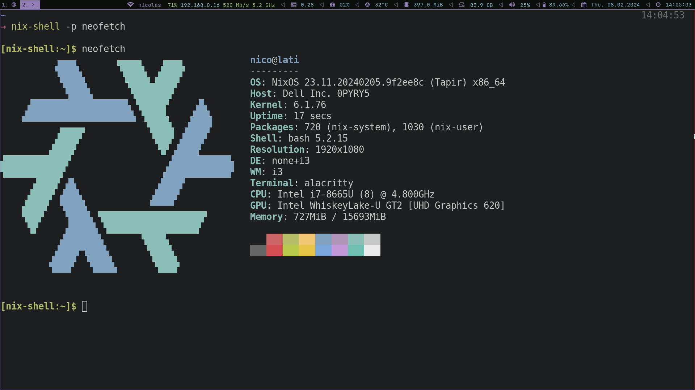

<h1 align="center">❄️</h1>

<h3 align="center">setup</h3>

```bash
$ nix-shell -p git curl
# install these dotfiles
$ curl https://raw.githubusercontent.com/nicochatzi/dotfiles/main/.nixfiles/scripts/install.sh \
    | bash
# build nixos for <HOST> (or add your host and rebuild)
$ sudo nixos-rebuild switch \
    --experimental-features 'nix-command flakes' \
    --flake ~/.nixfiles#<HOST>
# setup system
$ ~/.nixfiles/scripts/setup.sh
```

<h3 align="center">demo</h3>


