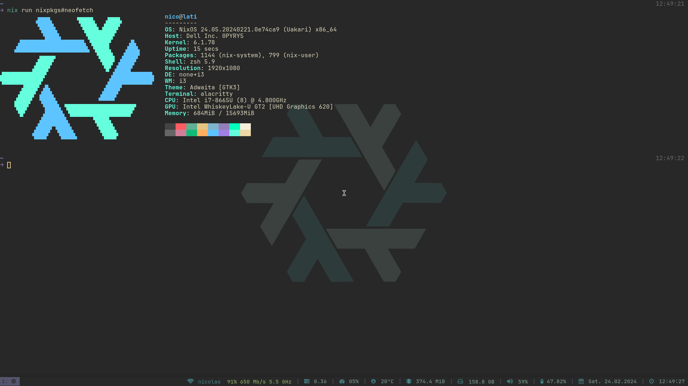

<h1 align="center">❄️</h1>

<h3 align="center">setup</h3>

```bash
# enter boot strapping shell - only on first build
$ nix develop
# build system for current host
$ sudo nixos-rebuild switch --flake ~/.nixfiles#$(hostname)
# dotfile installation and more - until I move to home-manager
$ curl https://raw.githubusercontent.com/nicochatzi/dotfiles/main/.scripts/setup-nixos.sh \
    | bash
```

<h3 align="center">dark</h3>



<h3 align="center">light</h3>


