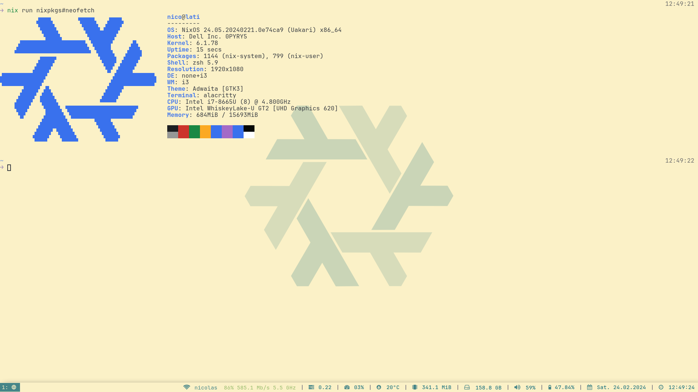

<h1 align="center">❄️</h1>

<h3 align="center">setup</h3>

```bash
# build nixos for <HOST> (or add your host)
$ sudo nixos-rebuild switch \
    --experimental-features 'nix-command flakes' \
    --flake ~/.nixfiles#<HOST>
# dotfile installation and more
$ curl https://raw.githubusercontent.com/nicochatzi/dotfiles/main/.scripts/setup-nixos.sh \
    | bash
```

<h3 align="center">dark</h3>


<h3 align="center">light</h3>


